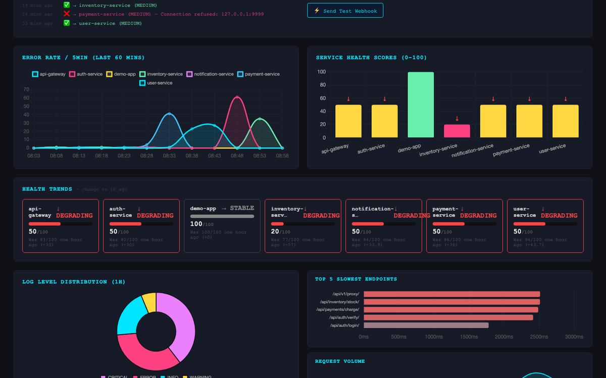
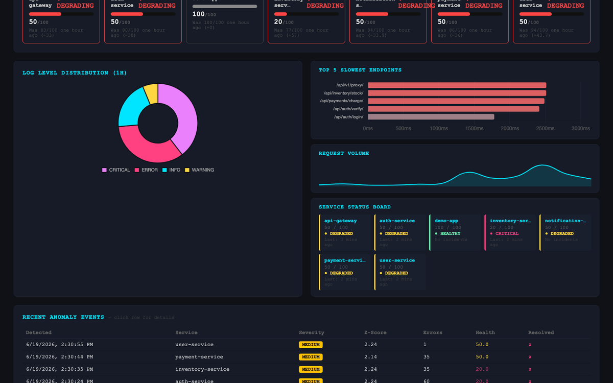
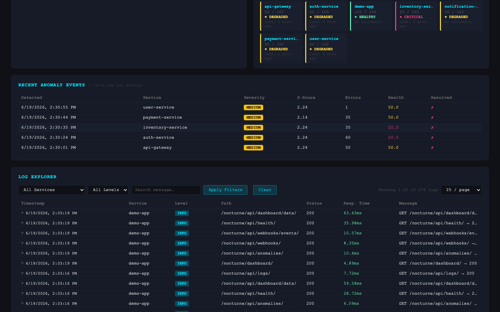
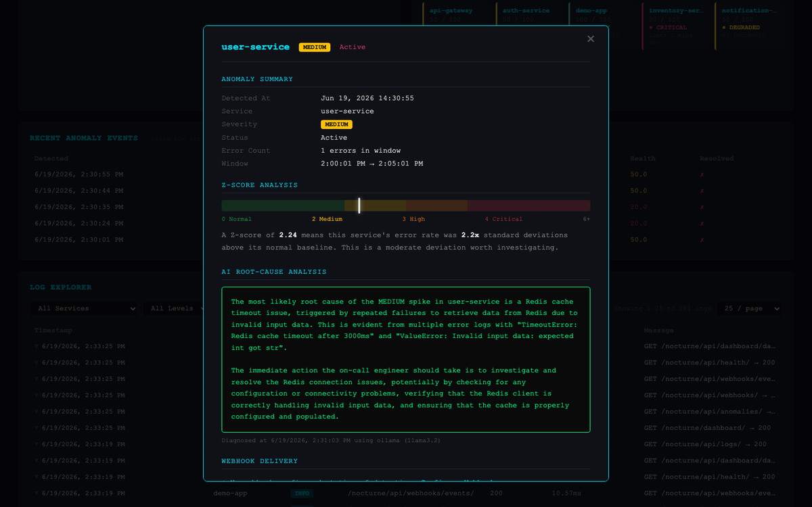
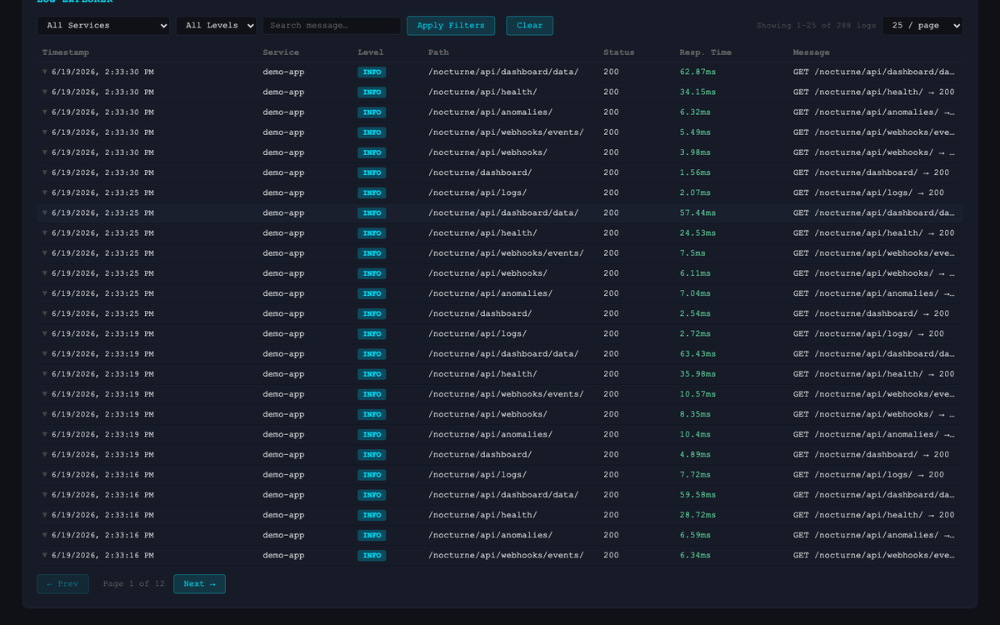
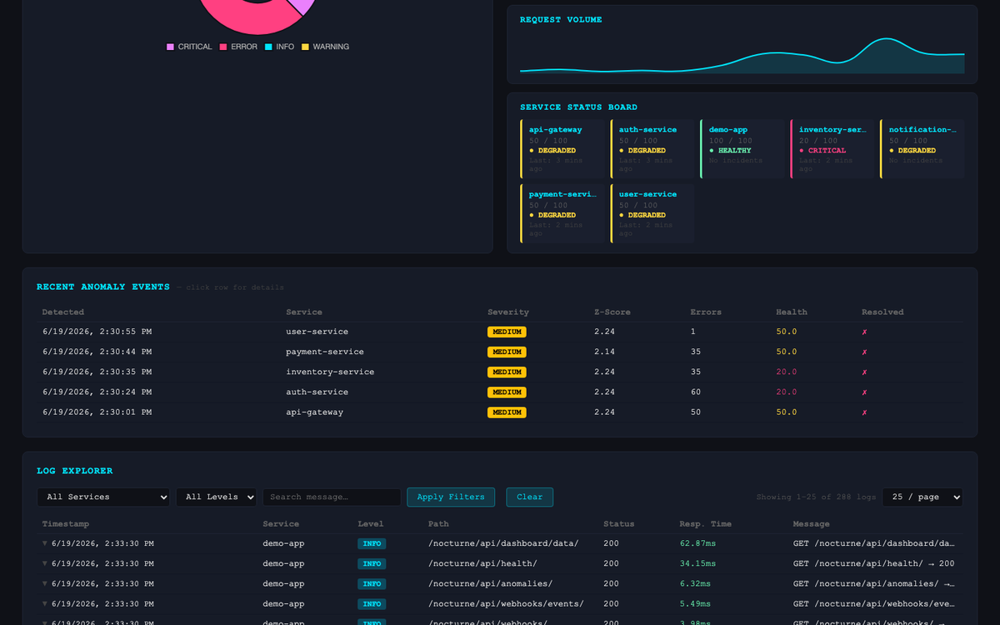
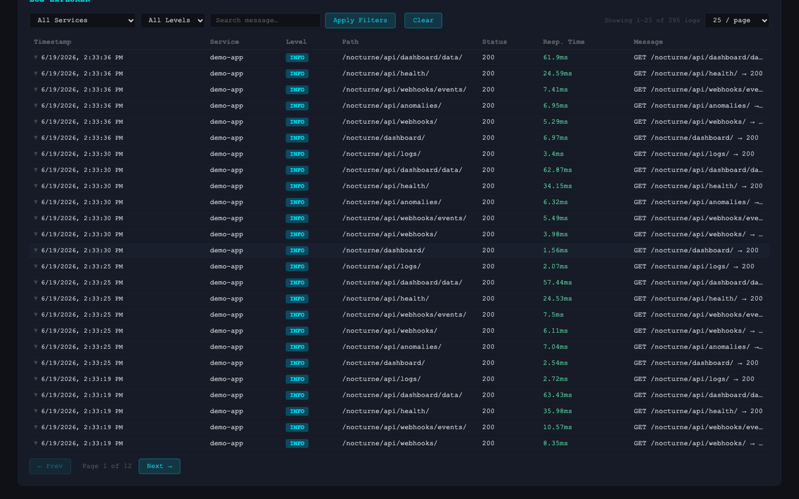
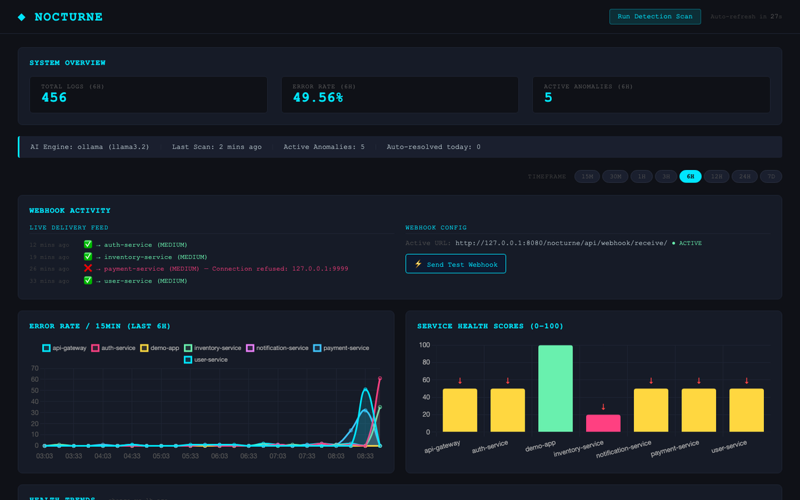
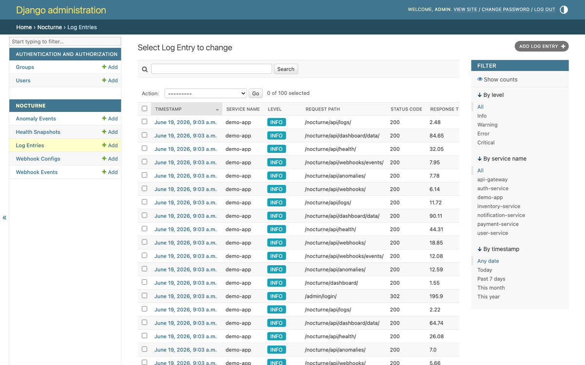
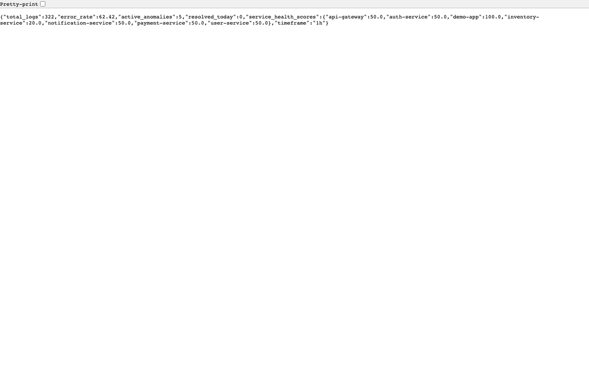

# nocturne-demo

[](https://pypi.org/project/django-nocturne/)
[](https://pypi.org/project/django-nocturne/)

A minimal Django project demonstrating
[django-nocturne](https://github.com/rishav00a/django-nocturne)
installed directly from PyPI.

This repo is the live demo referenced in the django-nocturne
documentation and screenshots.

---

## What this demonstrates

- django-nocturne installed via pip (not from source)
- NocturneMiddleware auto-capturing all requests with zero code changes
- 2000 demo log entries across 6 realistic services
- 4 injected error spikes with full Python stacktraces
- AI anomaly diagnosis powered by Ollama (llama3.2, local and free)
- Live dashboard at /nocturne/dashboard/
- Django Admin integration at /admin/nocturne/dashboard/
- All 12 REST API endpoints working

---

## Screenshots

> All screenshots taken from this demo project running locally
> with django-nocturne installed from PyPI.

### 🏠 Dashboard Overview

*Real-time system overview — total logs, error rate (1H),
and active anomalies. System Intelligence bar shows AI engine
status and last scan time.*

### 📈 Error Rate & Service Health

*Error rate per service over time (line chart) and
per-service health scores from 0-100 (bar chart).*

### 🍩 Log Distribution & Service Status

*Log level distribution doughnut, slowest endpoints,
and live service status board.*

### ⚠️ Anomaly Detection Table

*Detected anomalies with colored severity badges (MEDIUM/HIGH/CRITICAL),
Z-scores, error counts, health scores, and resolution status.*

### 🔍 Anomaly Detail Modal

*Click any anomaly row to see full details — Z-score meter with
color zones, plain English explanation, and LLM root cause analysis
in a terminal-style box.*

### 📋 Log Explorer

*Filterable, paginated log table with colored level badges,
response time color coding, and search by service/level/message.*

### 🔴 Stacktrace Viewer

*Click any ERROR/CRITICAL log row to expand — syntax-highlighted
Python stacktrace with file paths, line numbers, and exception
type badge. AI analysis button on the right.*

### 🤖 AI Log Analysis

*Per-log AI root cause analysis powered by your chosen LLM backend.
Shows root cause, immediate fix, and prevention — cached after
first analysis.*

### 🔔 Webhook Activity

*Live webhook delivery feed showing alerts fired when anomaly
thresholds were breached. Includes delivery status and payload.*

### 📉 Health Trends

*Service health trend cards showing direction of change —
degrading ↓, stable →, improving ↑ — with score comparison
against previous window.*

### ⏱️ Timeframe Filter

*Global timeframe filter (15M to 7D) — one click updates all
charts, tables, and stat cards simultaneously.*

### 🛡️ Django Admin Dashboard

*Full observability dashboard embedded inside Django Admin.
Accessible to superusers or users with view_nocturne permission.*

### 📊 Django Admin Anomaly List

*Django Admin anomaly list view with filters, search,
and bulk actions.*

### 🌐 REST API

*DRF browsable API — all 12 endpoints available at
/nocturne/api/ with authentication.*

---

## Services in the demo

| Service | Description |
|---------|-------------|
| auth-service | User authentication and JWT tokens |
| payment-service | Payment processing and billing |
| api-gateway | Upstream request routing |
| notification-service | Email and push notifications |
| user-service | User profile management |
| inventory-service | Product inventory tracking |

---

## Quick Start

```bash
git clone https://github.com/rishav00a/nocturne-demo
cd nocturne-demo
python -m venv venv
source venv/bin/activate
pip install django-nocturne[ollama]
python manage.py migrate
python manage.py createsuperuser
python seed.py
python manage.py snapshot_health
python manage.py runserver 8080
```

Visit:
- Dashboard: http://localhost:8080/nocturne/dashboard/
- Admin: http://localhost:8080/admin/
- API: http://localhost:8080/nocturne/api/health/

---

## Requirements

- Python 3.10+
- Ollama running locally
- llama3.2 model pulled

```bash
# Install and start Ollama
brew install ollama
ollama serve
ollama pull llama3.2
```

---

## Project Structure

```
nocturne-demo/
├── demo/
│   ├── settings.py        # NOCTURNE config lives here
│   ├── urls.py            # nocturne.urls mounted at /nocturne/
│   └── wsgi.py
├── seed.py                # Seeds 2000 log entries + 4 error spikes
├── manage.py
└── README.md
```

---

## NOCTURNE Settings

```python
NOCTURNE = {
    "AI_BACKEND": "ollama",
    "OLLAMA_BASE_URL": "http://localhost:11434",
    "OLLAMA_MODEL": "llama3.2",
    "ANOMALY_THRESHOLD": 2.0,
    "SERVICE_NAME": "demo-app",
    "AI_DIAGNOSIS_ENABLED": True,
    "LOGIN_URL": "/admin/login/",
}
```

---

## License

MIT
